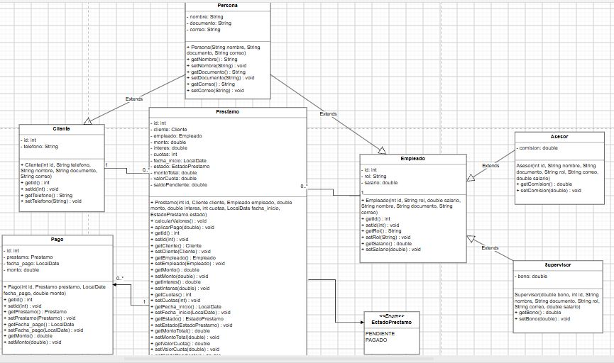

# Proyecto Java Sistema de Cobros de Cartera CrediYa

## Natalia Rolón Leal

Sistema de gestión de clientes, empleados, préstamos y pagos desarrollado en Java con arquitectura en capas (MVC + DAO + Utilidades), conexión a base de datos relacional MySQL y persistencia/respaldo en archivos de texto.

---

## Tabla de Contenidos

- [Acerca del Proyecto](#-acerca-del-proyecto)
- [Arquitectura del Sistema](#-arquitectura-del-sistema)
- [Tecnologías Utilizadas](#-tecnologías-utilizadas)
- [Estructura del Proyecto](#-estructura-del-proyecto)
- [Requisitos Previos](#-requisitos-previos)
- [Configuración e Instalación](#-configuración-e-instalación)
- [Demostración y Capturas de Pantalla](#-demostración-y-capturas-de-pantalla)
- [Autor](#-autor)

---

## Acerca del Proyecto

**Proyecto_Java_CrediYa** es una aplicación de consola modular diseñada para gestionar las operaciones fundamentales de una entidad crediticia. El sistema permite registrar, consultar, actualizar, eliminar y respaldar la información referente a:
- **Clientes:** Gestión de datos personales y de contacto.
- **Empleados:** Control de personal y roles de la entidad.
- **Préstamos:** Registro de montos, tasas de interés y estados.
- **Pagos:** Seguimiento e historial de amortizaciones.

---

## Arquitectura del Sistema

El proyecto está diseñado bajo un enfoque de **Separación de Responsabilidades** siguiendo los patrones:
- **MVC (Modelo-Vista-Controlador):** Desacopla la lógica de presentación (consola) de la lógica de negocio y persistencia.
- **DAO (Data Access Object) + Genéricos:** Uso de la interfaz `ICrudDAO<T>` para estandarizar las operaciones de acceso a datos sin duplicación de código.
- **Try-With-Resources & PreparedStatement:** Garantiza la gestión eficiente y segura de conexiones JDBC y previene ataques de inyección SQL.

# Diagrama UML

En caso de que no se vea muy bien el diagrama, este es el link para visualizarlo mejor:
https://drive.google.com/file/d/1OC8NZNiFWqcZXYln7jKE8vb8L8IeB4OK/view?usp=sharing 